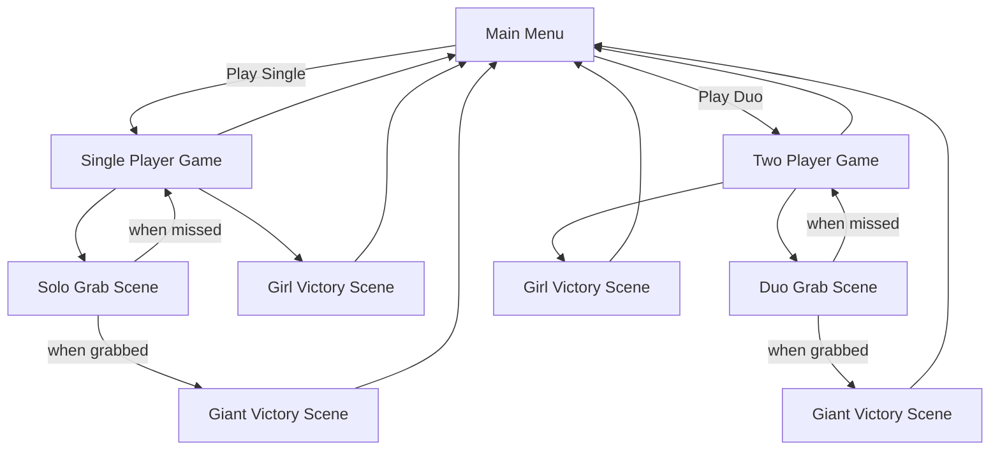

# Golden Escapade

## Developer & Contributions
**Alvin Chandrawinata** — Game Developer & Game Designer

# Introduction
My game is inspired by the classic folktale “Timun Mas”. It’s a two-player experience where one player becomes the Green Giant, trying to catch Timun Mas, while the other takes the role of Timun Mas herself, using abilities to escape. It’s a thrilling chase of cat and mouse.

# About
Golden Escapade: The Chase is a fast-paced 1v1 PvP game inspired by the classic Indonesian folklore. One player takes on the role of Timun Mas, using power ups and clever timing to escape, while the other becomes the Green Giant, also using power ups and strategic timing to hunt her down. Both players are given a set of unique skills that regenerate over time, creating a tense and dynamic chase where strategy and timing are the keys to victory. With balanced gameplay, skill-based mechanics, a little bit of luck, and endless replayability, every match is a thrilling retelling of the legendary escape.

The game focuses on:
- Reflex-based lane switching  
- Strategic skill usage  
- Procedural obstacle spawning  
- Real-time distance tracking between runners  

# Scene Flow Chart

# Scripts and Features

| | |
| ------------------------------ | ------------------------------- |
| | |
| | |
| | |
| | ETC |

# Controls

### The Girl
| Keybind                        | Action                          |
| ------------------------------ | ------------------------------- |
| **A / D**                      | Move left & right between lanes |
| **W**                          | Slow down the Giant             |
| **S**                          | Skill check the Giant           |
| **(Grab Scene)** **W / A / D** | Choose dodge direction          |

### The Giant
| Keybind                                   | Action                                                   |
| ----------------------------------------- | -------------------------------------------------------- |
| **Numpad 1 / 2 / 3**                      | Spawn obstacle in different lanes                        |
| **Numpad 4**                              | Confuse the Girl (reverse player 1 controls)             |       
| **Numpad 6**                              | Grab the Girl when close                                 |
| **Arrow Keys**                            | Perform the skill check input                            |
| **(Grab Scene) Arrow Keys** **← / ↑ / →** | Choose grab direction                                    |

### General Controls
| Keybind        | Action           |
| -------------- | ---------------- |
| **ESC**        | Open pause menu  |
| **/** or **?** | Show skill control |

