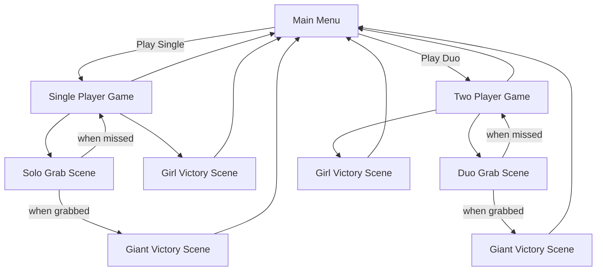

# Golden Escapade

## Project info
Editor Version : 2021.3.45f1 ---Updated---> 6000.2.12f1  
Ui Design : Corel DRAW 2020  
3D Modeling : Blender 4.3   

# Developer & Contributions
**Alvin Chandrawinata** — Game Developer & Game Designer

# Introduction
Golden Escapade is inspired by the classic folktale Timun Mas. This game is all about the escape scene changed into an intense 1v1 chase between Timun Mas (the Girl) and the Green Giant. Where both players must think fast, react faster, and use their abilities strategically to win.

# About
Golden Escapade: The Chase is a fast-paced 1v1 PvP runner game where:
- Player 1 controls Timun Mas, switching lanes and using abilities to slow or confuse the Giant.
- Player 2 controls the Green Giant, spawning obstacles and using grab attempts to stop her.

The game focuses on:
- Reflex based lane switching  
- Strategic skill usage
- Procedural obstacle spawning
- Real-time distance tracking between runners

Both players have unique abilities with cooldowns, encouraging prediction, skill checks, and moment-to-moment decision making.

# Gameplay

# Game Objective
### Girl (Timun Mas) Objective
- Run until the finish line
- Survive the Giant’s attacks and debuff effects
- Win by keeping triggering the Girl Victory condition

### Giant Objective
- Close the distance
- Use obstacles & disruption abilities to catch up to Timun Mas
- Perform a successful grab in the Grab Scene

# Scene Flow Chart

# Scripts and Features

| Script Name           | Description                                                                                        |
| --------------------- | -------------------------------------------------------------------------------------------------- |
| **bag_spawner**       | Spawns bags randomly in front of the girl while she runs.                                          |
| **camera_shake**      | Applies camera shake effects during impact or dramatic events.                                     |
| **collector**         | Detects when the girl hits a scattered bag and collects it.                                        |
| **data_game**         | Saves and tracks the Z position of both the girl and the giant for distance calculations.          |
| **destruct**          | Swaps rocks into a destroyed state and scatters debris pieces.                                     |
| **pause_manager**     | Pauses the game and opens the pause menu UI.                                                       |
| **restore_pos**       | Resets the positions of the girl and giant after the girl escapes the grab scene.                  |
| **rock_fade**         | Handles fading out scattered rock pieces for performance optimization.                             |
| **rock_spawn**        | Spawns rocks in specific lanes based on Player 2 (Giant) input.                                    |
| **giant_movement**    | Controls the Giant’s forward movement, acceleration, and speed bar.                                |
| **girl_skill**        | Manages the girl’s skill system, energy, cooldown UI, and skill event triggers.                    |
| **grab_manager**      | Controls the grab scene logic, QTE inputs for both players, and decides win/loss outcome.          |
| **hint**              | Shows on screen skill instructions that fade out automatically and reappear when pressing / or ?.  |
| **one_player_button** | Loads the single player mode and clears PlayerPrefs when the Solo button is clicked.               |
| **two_player_button** | Loads the two player mode and clears PlayerPrefs when the Solo button is clicked.                  |

# Controls

### The Girl
| Keybind                        | Action                          |
| ------------------------------ | ------------------------------- |
| **A / D**                      | Move left & right between lanes |
| **W**                          | Slow down the Giant             |
| **S**                          | Skill check the Giant           |
| **(Grab Scene)** **W / A / D** | Choose dodge direction          |

### The Giant
| Keybind                                   | Action                                                   |
| ----------------------------------------- | -------------------------------------------------------- |
| **Numpad 1 / 2 / 3**                      | Spawn obstacle in different lanes                        |
| **Numpad 4**                              | Confuse the Girl (reverse player 1 controls)             |       
| **Numpad 6**                              | Grab the Girl when close                                 |
| **Arrow Keys**                            | Perform the skill check input                            |
| **(Grab Scene) Arrow Keys** **← / ↑ / →** | Choose grab direction                                    |

### General Controls
| Keybind        | Action           |
| -------------- | ---------------- |
| **ESC**        | Open pause menu  |
| **/** or **?** | Show skill control |

# Download Game

Link to the game : https://nivtee.itch.io/golden-escapade?secret=brGGJnaQqHVjSrMpvJtqmXnQwM
   

